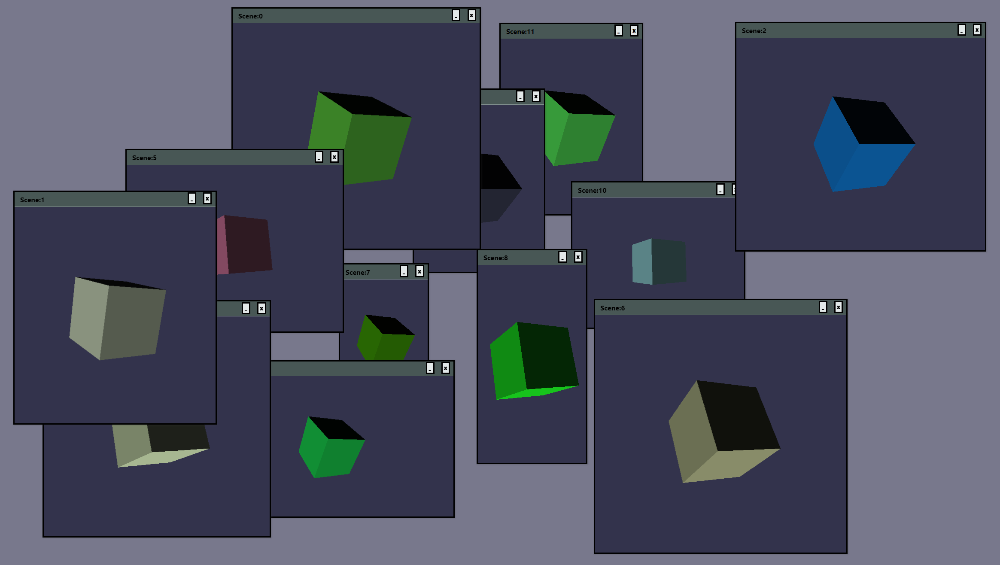

# Pane-Editor-Framework

This is a react based editor UI framework thats main focus is to interact with the BABYLON.js webGL multi-canvas rendering API.


## Installation
``` npm install ```
or 
``` yarn install ```

## Starting Localhost:3000
``` npm start ```
or 
``` yarn start ```

### Contact & Credits

Pryme8@gmail.com 

